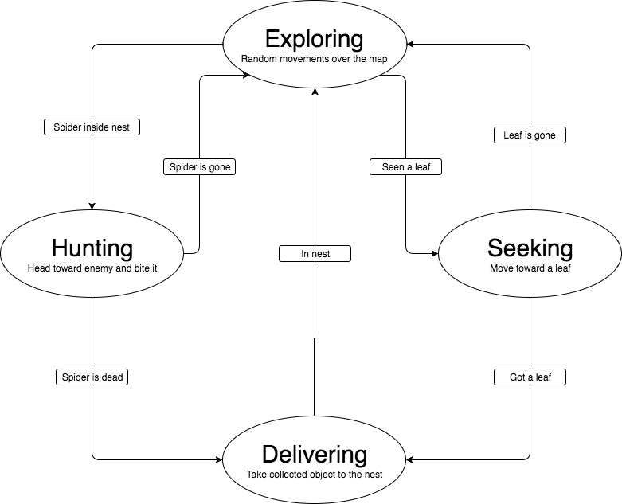

# Ants Simulation

This is a simple ant colony AI simulation.
The main goal of the ants is to search and collect the maximum number of leaves possible and defend the nest if a spider
cross the nest's area.

This is the diagram of the ant's brain. The arrows define the links between the states and the conditions that must be
satisfied to switch states.


## Screenshot


## Getting Started

These instructions will get you a copy of the project up and running on your local machine for development and testing purposes.

### Prerequisites

Python 2.7+

### Installing

To download, install and run the project follow the instructions:

```
git clone https://github.com/computationalcore/ants-simulation
cd ants-simulation
python setup.py install
```

Python the setup will install all python dependencies.

To run the simulation

```
$ python main.py
```

It is possible to toggle between fullscreen/windowed mode by pressing F key.

To change simulation settings open the app.cfg and change some values.
Default settings:
```
[general]
# Resolution of the simulation
screen_size_x = 640
screen_size_y = 480
# Number of simulated ants
ants = 30
# HP value for the spider entity (each ant bite takes 1 HP)
spider_health = 40

[nest]
# X,Y position of the nest
position_x = 320
position_y = 240
# Diameter of the nest
size = 100.
```

## Images

Bellow follows the credit of the images used:

* Spider - Public domain [https://commons.wikimedia.org/wiki/File:Spider.svg](https://commons.wikimedia.org/wiki/File:Spider.svg)
* Leaf - Attribution: Tael & Marion Lecorche [https://commons.wikimedia.org/wiki/File:Leaf.svg](https://commons.wikimedia.org/wiki/File:Leaf.svg)
* Ant - Attribution: Jacob Eckert, from The Noun Project [https://commons.wikimedia.org/wiki/File:Ant_(Jacob_Eckert).svg](https://commons.wikimedia.org/wiki/File:Ant_(Jacob_Eckert).svg)

## Notes
This project is based on the artificial intelligence chapter of the book [Beginning Game Development with Python and Pygame:
From Novice to Professional](https://www.apress.com/br/book/9781590598726)

## License

This project is licensed under the MIT License - see the [LICENSE](LICENSE) file for details


## Acknowledgments
* [Apress](https://www.apress.com/br/book/9781590598726)
* [Will McGugan](https://www.willmcgugan.com/)
